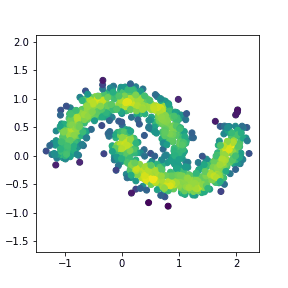
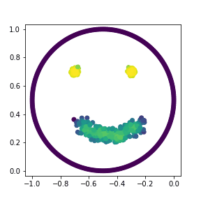

# GIT: Clustering Based on Graph of Intensity Topology 

This repository contains the implementation code for paper:<br>__GIT: Clustering Based on Graph of Intensity Topology__<br>

## Brief introduction

Accuracy, Robustness to noises and scales, Interpretability, Speed, and Easy to use (ARISE) are crucial requirements of a good clustering algorithm. However, achieving these goals simultaneously is challenging, and most advanced approaches only focus on parts of them. 

Towards an overall consideration of these aspects, we propose a novel clustering algo rithm, namely GIT (Clustering Based on Graph of Intensity Topology). GIT considers both local and global data structures: firstly forming local clusters based on intensity peaks of samples, and then estimating the global topological graph (topo-graph) between these local clusters. We use the Wasserstein Distance between the predicted and prior class proportions to automatically cut noisy edges in the topo-graph and merge connected local clusters as final clusters. Then, we compare GIT with seven competing algorithms on five synthetic datasets and nine real-world datasets. 

The pipeline is shown as below:

<p align="center">
     <br>
</p>

We show the process of clustering on toy datasets as follows:

<p float="center">
    
</p>

## Overview

* `git_cluster/` contains the core algorithm.
* `dataloaders/` contains dataloader classes for different datasets.
* `utils/` includes measurements and plot tools for understanding clustering 150.
* `ex1_toy/` is reproducing experiments on toy datasets.
* `ex2_real/` is reproducing experiments on real datasets.
* `ex3_mnist/` is reproducing experiments on mnist and fashion-mnist datasets.

## Installation

Build `setup.py` and install GIT:

```
python setup.py build
python setup.py install
```

Try to import the package:

```
from git_cluster import GIT
```

## Usage 

We have provided `quick_start.ipynb` as an example, and users can refer this notebook.

We first read the data through `toy_dataloader`:

```
from dataloaders import Toy_DataLoader as DataLoader
X, Y_true = Dataloader(name='circles).load()
```

Then, build GIT class and choose decent hyperparameters `k`:
```
from git_cluster import GIT
git = GIT(k=10)
```

The predicted results are available through `fit` method.
```
Y_pred = git.fit_predict(X)
```


## Reproduce the results in our paper

### Dependencies
* python >= 3.7
* hdbscan == 0.8.26
* pandas==1.3.4
* plotly==5.3.1
* scikit-learn==0.23.2
* scipy==1.7.1

### Reproducing steps
1. We have provided an environment setting file of conda. Users can easily reproduce the environment by the following commands:

```
  conda env create -f environment.yml
  conda activate git_cluster
```

2. We compare our method with various clustering methods, among which Quichshift++ requires an extra installation. Users should follows the usages from [its official github repository](https://github.com/google/quickshift). Here, we recommend users run the following commands:

```
git clone git@github.com:google/quickshift.git
cd quickshift
python setup.py build; python setup.py install
```

3. Open the jupyter notebooks in `ex1_toy`, `ex2_realdata`, `ex3_mnist`.

## Citation
If you find this code or idea useful, please cite our work:
```
@article{gao2021git,
  title={Git: Clustering Based on Graph of Intensity Topology},
  author={Gao, Zhangyang and Lin, Haitao and Tan, Cheng and Wu, Lirong and Li, Stan and others},
  journal={arXiv preprint arXiv:2110.01274},
  year={2021}
}
```

## Contact
If you have any questions, feel free to contact us through the following emails or Github issues. 
### E-mails
gaozhangyang@westlake.edu.cn or tancheng@westlake.edu.cn